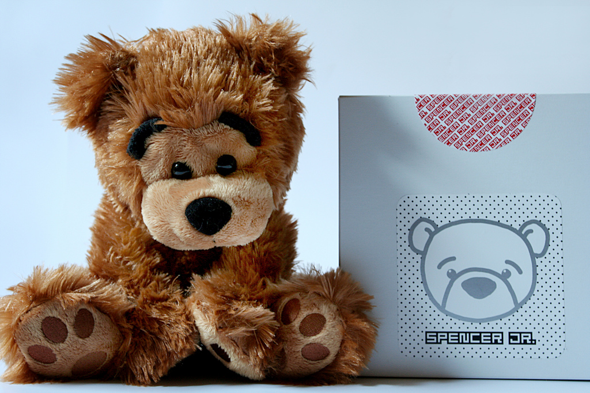
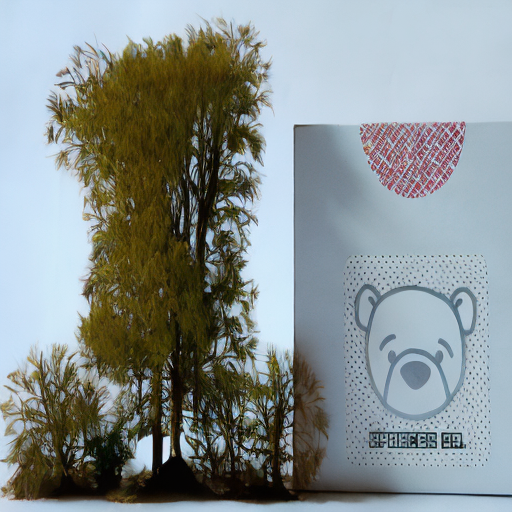
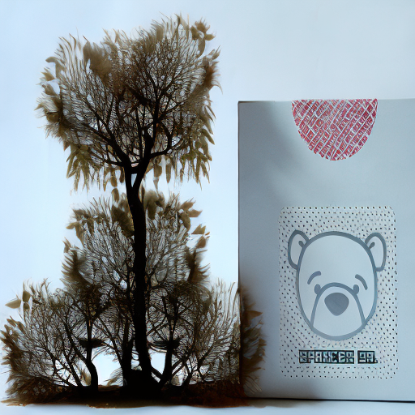

<!-- ---
layout: default
---

Text can be **bold**, _italic_, or ~~strikethrough~~.

[Link to another page](./another-page.html).

There should be whitespace between paragraphs.

There should be whitespace between paragraphs. We recommend including a README, or a file with information about your project. -->

# Introduction

Conventional methods of manipulating images sometimes need laborious pixel-by-pixel procedures, which may be difficult and time-consuming, particularly for intricate adjustments. There is a need for more efficient and user-friendly tools for modifying photographs and making adjustments to the image at a higher level of abstraction. This problem is particularly interesting to study as it will provide users with the ability to manipulate images in a natural way by adjusting the scene graph. This will provide semantic image modification that is consistent with human comprehension. This issue must be addressed as there's a rising demand for advanced image editing software across industries like graphic design, digital art, and visual storytelling. Scene Graphs provide an easy way to represent elements of the image that can be easily visualised and presented to the user. Taking this to our advantage, it can be used to manipulate elements within the image intuitively.

This project aims to create a system that predicts and modifies semantic scene graphs in response to user interactions using semantic image manipulation, giving users the ability to directly alter nodes and edges in the scene graph to alter the content of the image as requested. We aim to offer the following functionalities to the user:

* Generate a scene graph for the image input by user, letting the user interact with the nodes and relationships between nodes.
* Allow the user to select a node/object to remove from the image.
* Allow the user to select a node to replace by a new object, as specified by the user as a text prompt.

|  |
|:-------------:|
| *Figure 1: KGInPaint - Image InPainting with Interactive Scene Graphs* |

**Please click on the thumbnail below to view the demo video**

| [](https://www.youtube.com/watch?v=tGeAod6Y3TA) |
|:-------------:|
| *KGInPaint Demo Video Link* |

## Related Works

- The Relation Transformer (RelTR) [1] paper’s methodology entails the detection of triplet proposals solely based on visual appearance, leading to a reduction in parameters and faster inference compared to other Scene Graph Generation (SGG) models. This approach enables the concurrent prediction of subjects, objects, and their predicates [2]. Inspired by DETR [11], a proficient object detection model, they approached scene graph generation as a set prediction challenge, introducing an end-to-end model with an encoder-decoder architecture. The encoder focuses on visual feature context, while the decoder deduces a fixed-size set of triplets using various attention mechanisms involving coupled subject and object queries. The paper devises a set prediction loss to facilitate end-to-end training by matching ground truth and predicted triplets, by experimenting on the Visual Genome [5] and Open Images V6 datasets. This one-stage method employs subject and object queries learned from the data to decode visual appearances, resulting in the generation of a sparse scene graph and still helps achieve state-of-the-art performance. 
- In his paper, Hu et al. [2] introduced an approach using hand crafted image editing, that uses graphs to perform replacement of image patches. This paper predominantly focuses on copying and pasting operations. Our proposed method on the other hand would try to look at advanced semantic edits and address object deformations. 
- This repository [3] created a system for removing objects from images using deep learning techniques, specifically image segmentation and inpainting. The goal is to accurately detect and remove objects outlined by the user while preserving surrounding context. Methodologically, the system employs Mask-RCNN for precise object detection via instance segmentation and DeepFillv2 [4] for inpainting utilizing gated convolutional networks. The key points include the utilization of pre-trained weights for DeepFillv2 [4], and the demonstration of results showcasing the effectiveness of the system in removing selected objects from images while maintaining visual coherence. 
- The authors of this study [4] provide a brand-new generative image inpainting technique that can finish pictures using erratic masks and human input. To overcome the drawbacks of conventional convolutions, their solution makes use of gated convolutions, which are trained on a massive number of unlabeled pictures. Gated convolutions improve flexibility by providing a dynamic feature selection mechanism across layers, in contrast to vanilla convolutions, which consider all input pixels identically. Additionally, traditional global and local Generative Adversarial Networks (GANs) are not ideal for free-form masks since they can appear anywhere in pictures with any shape. The authors suggest SNPatchGAN, a patch-based GAN loss that uses a spectral-normalized discriminator on dense picture patches, as a solution to this problem. This formulation is simple, enables quick and consistent training, and produces flexible, high-quality outcomes for both user-guided extensions and automatic picture inpainting. They have shown that the usage of gated convolutions with free-form masks and user guiding input leads to a considerable improvement in inpainting outcomes. 
- Newer studies in the domain have been exploring interactive image generation via scene graphs and layouts. [5,6] They involve processing a graph or layout to produce multiple variations of an image. They focused on utilizing graphs with simplified spatial relations (easy relative positions for objects like "right of" or "under" in [5] or using no relations [6]. Our proposed method differs from this as we will be manipulating existing images. 

Our approach of combining interactivity on scene graphs and providing the user the ability to provide text prompts to define what modifications is what makes the system extremely unique to other inpainting implementations

## Methodology and Approach

### Method Overview
Many current approaches to scene graph generation involve utilizing an object detector like FasterRCNN and employing specific neural networks to deduce relationships. In the initial stage, the object detector proposes objects, while the second stage involves a relationship classifier labelling edges between these proposals. Despite significant advancements, these two-stage methods are hindered by the limitation that they require a substantial number of trained parameters.

Our initial implementation followed the paper on Unibiased Scene Graph generation via Causal Total Direct Effect [12]. This paper’s work helped us achieve desirable results and correct bounding boxes and object-relationship graphs. The conventional prediction model operates by observing the entire graph output given an image, lacking insight into the specific impact of object pairs on their predicate. In contrast, adopting causal inference allows for a more nuanced approach. Graphically, there’s no imperative to process the entire graph collectively; instead, manipulation of specific node values reveals their impact. Instead of relying on fixed and potentially biased estimates, we strive for unbiased predictions by comparing the actual outcome with its context-specific counterfactual alternative. This context-specific bias, denoted as Total Direct Effect, was part of our focus in our efforts to eliminate it from our predictions.

<!-- Moving away from static and potentially biased likelihood, unbiased prediction is achieved by discerning the difference between the observed outcome $`Y_x (u)`$ and its context-specific counterfactual counterpart $Y_{\bar{x},\bar{z}}(u)$.  This context-specific bias, expressed as $TDE =  Y_x (u) - Y_{\bar{x},\bar{z}}(u)$ is targeted for removal from predictions. -->


However, due to inconveniences encountered during the integration of the scene graph generation model with the interactive user interface, because of outdated libraries and packages, we changed our scene graph model implementation, taking inspiration from a much newer research paper, RelTR. This of course, required us to make multiple changes to the code, as the outputs generated by this newer paper's model was not correctly applicable when dealing with the Visual Genome dataset. 

The Relation Transformer (RelTR) methodology, entails the detection of triplet proposals solely based on visual appearance, leading to a reduction in parameters and faster inference compared to other Scene Graph Generation (SGG) models. This approach enables the concurrent prediction of subjects, objects, and their predicates [7]. Inspired by DETR [11], a proficient object detection model, they approached scene graph generation as a set prediction challenge, introducing an end-to-end model with an encoder-decoder architecture. The encoder focuses on visual feature context, while the decoder deduces a fixed-size set of triplets using various attention mechanisms involving coupled subject and object queries. The paper devises a set prediction loss to facilitate end-to-end training by matching ground truth and predicted triplets. Extensive experiments on the Visual Genome and Open Images V6 datasets showcase the superior performance and rapid inference capabilities of this model.

The Knowledge graph generator model is trained on the Visual Genome dataset, a Visual Question Answering (VQA) dataset consisting of scene graphs describing the images, and the motivation behind this dataset was to utilise these scene graphs for VQA. The Visual Genome dataset consists of seven main components: region descriptions, objects, attributes, relationships, region graphs, scene graphs, and question-answer pairs. However, we have not focused on its VQA elements. We plan to use the Visual Genome dataset for evaluating the predicted objects, their bounding boxes and the respective relation labels. Since the dataset also contains scene graphs, the in-painting aspect and the scene graph generation aspect of the paper can be done independently as well. We will specifically be using Version 1.4 for this. The entire dataset is about 15.67 GB in size. The dataset can be found here. 

In contrast to prevailing sophisticated methods that classify dense relationships among all entity proposals derived from the object detection backbone, this one-stage method employs subject and object queries learned from the data to decode visual appearances, resulting in the generation of a sparse scene graph and still helps achieve state-of-the-art performance. 

Next, we have implemented Inpainting using two popular models in the process, the SAM (Segment Anything) Model [10] by Meta and a HuggFace Inpainting model. The SAM model is a well-known model used to create masks for objects in images. Having been trained on a large dataset containing 1 Billion segmentation masks on 11 million images, it performs favorably on new images and tasks while showing great IOU scores. SAM is unique because can work with instructions like segmenting as per a specific point or a bounding box. On selecting a node, our dashboard passes on the selected node’s bounding box and the input image to generate a mask of the object’s segment within the bounding box. 

Then the segmented image mask, along with the original image, is sent to the Hugging Face [8] Inpainting Stable Diffusion v2 model which is a Diffusion model capable of inpainting using text-to-image generation. The model is able to produce high-quality inpaintings and capture complicated dependencies because of this approach. HuggingFace's inpainting models stand out for their dependability, efficiency, and user-friendliness. They have been optimized to perform a variety of inpainting jobs well through pre-training on huge datasets and hence, suit our needs perfectly. 

We provide the input image along with the image mask delineating the selected object (node) to the HuggingFace (HF) model, along with a corresponding prompt indicating whether to remove or add another object. The model then generates a sequence of output images, allowing the user to select the one that best showcases the inpainting result. This pipeline ensures the user can make an informed decision based on the quality and suitability of the inpainted images.

For removal of node, a button has been implemented. When the user selects the node for object removal and clicks on the ‘Remove Object’ button, it automatically sends the image with bounding box, along with a prompt that says ‘add background’. Thus, the user doesn’t need to write a prompt for this task. For replacing an object, the user first selects the node for object replacement and then writes a prompt in the text box implemented on the dashboard. 
The object is then replaced using its mask based on the corresponding prompt and the inpainted images are displayed to the user.

The final KGInPaint dashboard user flow to select nodes and edges:
‘
1. The Plotly UI dashboard has been hosted for the user to upload their initial query image.
2. This initial query image is then loaded onto the GPU using a subprocess wherein the RelTR model predicts the Scene Graph for the given input image.
3. The input file path as well as the predicted outputs are sent back to the Visualization app. The predicted scene graph is stored as JSON on the system, which the dashboard can access locally.
4. The user will be able to see and interact with the Scene Graph generated for the input image. Basic Scene Graph interactivity features: 
* selection
* dragging 
* zooming 
* panning
5. The user can select nodes and edges on the scene graph to highlight their corresponding predicted bounding boxes within the image.
6. On the selection of a node, the user can also see every subject-predicate-object triplet that the selected node is a part of. The relations of the selected nodes are read from the metadata and displayed in the Relations table.
7. When the user selects a node in the scene graph and then presses the delete node button, a new inpainted image is generated with that clorresponding object removed from the original image.
8. On selecting a node and then writing a prompt in the text box, the object will be replaced by the object mentioned in the prompt and the inpainted image will be the output.
9. User gets an option to download any of the several inpainted images.

|  |
|:-------------:|
| *Figure 2: Overview of the Methodology of our project* |

|  |
|:-------------:|
| *Figure 3: Overview of the Inpainting Subsystem* |

### Contribution
Although, our approach involves making use of existing models, our system seamlessly integrates multiple models and functionalities into one. It jointly handles the task of knowledge scene graph generation, allowing the user to interact with it, and then giving the option to inpaint the images as desired. No prior work has been attempted that lets users interactively inpaint images 

### Intuition
- Efficiency and Speed: By recognising triplet proposals based just on visual appearance, the Relation Transformer (RelTR) article aims to reduce parameters and accelerate inference. This seems to be in line with our strategy, which speeds up inference by concentrating on topic and object queries discovered from the data and employing one-stage approaches.
- Advanced Edits for Semantics: Our suggested approach tries to address more complex semantic alterations and object deformations, whereas some current solutions, like Hu et al., concentrate on simple copy-paste operations. This is accomplished by combining inpainting models that can handle complicated inpainting tasks, such as the Hugging Face Inpainting Stable Diffusion v2 model and the SAM Model.
- Flexibility and User-Friendliness: Our method takes into account models that have been pre-trained on extensive datasets to optimise them for a range of inpainting tasks, which makes them appropriate for a range of user requirements. Furthermore, our KGInPaint dashboard's user interface makes the scene graph easier to work with, selects nodes and edges, and offers choices for removing and replacing objects as well as downloading inpainted photos.
- Independence of Inpainting and Scene Graph Generation: Our method permits the independent creation of inpainting and scene graphs, offering users flexibility and opportunity for experimentation. Through the utilisation of the Visual Genome dataset for both inpainting and scene graph evaluation, we can guarantee thorough study and verification of your technique.

## Experiment Setup 

### Experiment Purpose
Our experiments took into account different values for Inference, quality of prompts, Strength, and number of images generated per prompt and we experimented with 2 models for this. Inference Steps, i.e., the number of de-noising steps, gets modulated by strength. Strength is the extent to which the image will be transformed and ranges from 0 to 1. Image is used as a starting point and the more noise that is added, the higher the strength. On comparing the StabilityAI and the RunwayML models for inpainting, StabilityAI showed us drastically better results for the different parameters and input values, so we proceeded with the StabilityAI for all our experiments.

We performed multiple experiments, comprising of a variety of different images and different prompts. For object removal the prompts we were using were “remove node”, “add background”, “remove object, add background” and “background”. For object addition the prompts we were experimenting on were “background, add [object name]”, “remove background, add [object name]” and “add [object name]”. 

For the purpose of our experiments, we made use of NVIDIA RTX 3070 GPU with a total memory size of 8 GB.

We conducted experiments to evaluate our system both qualitatively and quantitatively. For quantitative metrics, we focused mainly on the mIoU score for segmentation. Latency for KG Generation, Segmentation and Inpainting are measured separately as a part of our quantitative measures. Details about our Qualitative analysis are described in detail in the results section..

### Input Description
We are using VisualGenome dataset [9] which has 108251 images (15.55GB). The individual image sizes were ranging from 10KB to 950KB. The image dimensions are also variable ranging from 500x500 to 800x800. 

| Input Image | Input Image with Bounding Boxes of Selected Node | Segmentation Mask of the Selected Node |
|:-------------:|:-------------:|:-------------:|
|  |  | |

Our system allows a total of 50 relationships, for example, above, across, in front of, lying on, on top of, etc. It allows a total of 150 objects that can be added when replacing a node, for example, airplane, animal, apple, bear, cake, camera, candle, girl, glass, etc. These relationships and objects are compatible with the VisualGenome dataset [9].

### Desired Output Description
The desired output is the inpainted image where the selected node has either been removed or replaced according to the prompt provided by the user.

### Metrics for Success

We used IoU as a key metric as our system involves segmentation. Because of its quantitative evaluation, which measures the overlap between anticipated and ground truth annotations, IoU is frequently used for evaluating picture segmentation. Because it is a standard measure, can be thresholded for specificity, and is resistant to changes in object size.

### User Survey Evaluation
Our primary focus was improving user interaction during queries, and to evaluate our system's performance qualitatively, we conducted user surveys. The primary focus of these surveys was to gather user's feedback on the usability and effectiveness of our system through their interactions. In these surveys, users rated different aspects of the system based on their specific queries. Due to time constraints, we limited our user surveys to 10 students.

The participants in this survey were graduate students from Georgia Institute Of Technology. The users were first briefed about the system's purpose, functionality and features, and then provided a guided demonstration to ensure that they understand the key aspects of this system. Finally, they were provided an overview of the system's capabilities, basic operations and examples of potential outputs.
Each participant was then requested to engage with the system by testing 3 to 5 images from our curated dataset. On average it took, 15-20 mins per participant. The specific guidelines given to the user for this process were as follows:

Object Selection: Participants were asked to choose various objects in the images that catch their interest i.e. diversity was encouraged in their selections.
Relation Identification: Participants were asked to identify and select different relations (if applicable) they found interesting within the images.
Feedback Gathering: Following their interaction, participants were asked to share their thoughts, experiences, and any difficulties encountered within a Google Form

The questions within the user survey primarily focused on the following aspects:

Usage and First Impressions: The users were asked to rate the system on whether the process of accessing the KGInPaint system was straightforward i.e. did they find the system user-friendly. They were also asked how many attempts did it take for them to successfully generate their first inpainted output image.

Scene Graph Generation Quality: They were asked to quantify the accuracy of the scene graph representation and whether there were instances in which the scene graph generation failed. There were separate questions about the accuracy of predicted nodes, predicted relationships and the corresponding bounding boxes.

Inpainting evaluation: They were asked to quantify the number of relevant outputs on adding/removing nodes(objects) for the system based on how many irrelevant images they got in their outputs.

Effectiveness of Interactivity and Response Time: We asked the user to evaluate how many clicks it took on average for them to select and search for objects/relationships in the scene graph i.e. whether the UI was smooth enough. Next, we also asked them how consistently fast was the system in delivering outputs for both adding and removing objects from images.

Overall Satisfaction: Users were asked how would they rate their overall satisfaction with KGInPaint. Further, they were also asked if they would recommend this system as a data annotator tool in the future.


## Results
RelTR performed drastically better than other methods we followed for scene graph generation. Notably, the RelTR model demonstrates superior performance compared to general models without unbiased learning, excelling in mean Recall (mR@K) and zero-shot Recall (zsR@K). Two-stage methods incorporating unbiased learning exhibit enhanced mR@K and zsR@K but experienced a notable decrease in Recall (R@K). The RelTR model stands out for its balanced performance across all three recall metrics. The results reported by RelTR are illustrated below. In terms of time taken for the generation of a scene graph by the RelTR model, it takes about 24 seconds to generate a scene graph for a given input image.

### User Survey Results:
The users had the following feedback for different areas of KGInPaint:
Usage and First Impressions: All the users found the system to be straightforward to use and interact with. It took an average of 1 to 3 attempts for an user to generate their first output successfully using the system. The overall average user rating for this section was 4.7 on a scale of 5 from the users.
Scene Graph Generation Quality: All the users said that the scene graph generation sometimes failed to match the image content during their tests. The average user rating was 3.7 on a scale of 5 for this aspect of the system. Users appreciated the scene graph generation model but noticed duplicate nodes, impacting our ratings.
Inpainting quality: Users said that they typically got around 1 to 3 irrelevant search results in the remove or replace node operations. They gave an average rating of 4.2 over 5 for the inpainted images’ relevance.
Effectiveness of Interactivity and Response Time: The users were pretty satisfied with the UI interactivity and the speed of the results and gave an overall rating of 4.5 for this bit.
Overall Satisfaction: Some users said they liked the "select your object of interest" concept in this tool and the system was overall fun to play with. Some also wanted the old scene graph for the image to be updated, once an object has been added or removed in the initial image. Our user feedback evaluation plan is currently only limited to a few individuals due to resource and time constraints. The users gave an overall rating of 4.1 for this bit. There isn’t a scalable way to evaluate human feedback on our system’s performance yet. This could also be explored as one of the potential future directions of research. The users also mentioned that the 'replace' function is performing significantly better than 'remove'. Our user survey scores are summarized in the table below. 

| Area                                          | Average Rating (out of 5) |
|-----------------------------------------------|---------------------------|
| Usage and First Impressions                   | 4.7                       |
| Scene Graph Generation Quality               | 3.7                       |
| Inpainting Quality                           | 4.2                       |
| Effectiveness of Interactivity and Response Time | 4.5                       |
| Overall Satisfaction                         | 4.2            |

### Key Result Presentation:
Our images demonstrated an IoU value of 0.998 for the segmentation of the teddy bear and an IoU value of 0.999 for the segmentation of the elephant. For the segmentation task, we performed experiments on 10 different images, and achieved an average IoU value of 0.95 over the two inpainting tasks.


Some example image inputs and outputs:

| Input Image | Knowledge Graph | Input Image with Bounding Boxes | Segmentation Mask of the Input Image |
|:-------------:|:-------------:|:-------------:|:-------------:|
|  | |  | |

Given the prompt *"add green tree"* for **Object Addition** we get the following resulting images:

|  |  |  |
|:-------------:|:-------------:|:-------------:|
| *Output 1* | *Output 2* | *Output 3* |

Let's produce additional outputs for new input images.

| Input Image | Knowledge Graph | Input Image with Bounding Boxes | Segmentation Mask of the Input Image |
|:-------------:|:-------------:|:-------------:|:-------------:|
|  |  |  |  |

Given the prompt *"add background* for **Object Removal** we get the following resulting image:


Given the respective prompts for **Object Addition** we get the following resulting image:

|  |  |  |
|:-------------:|:-------------:|:-------------:|
| *Prompt "add panda"* | *Prompt "add tiger"* | *Prompt "add white ball"* |

Failure case - One instance prompted "add watermelon":


### Key result performance
On trying the different variants of our approach by changing the values for Inference, generated images per prompt and the quality of prompts, we observed the following results.
On increasing inference (number of de-noising steps), the quality of the generated output was better but the time taken increased quite a lot. This was also observed on changing the number of images per prompt that were generated as time increased when this value was increased. The quality of prompts seemed to make a huge difference when it came to the replace object task. The prompts “add background” and “background, add [object name]” gave us the best outputs for object removal and object addition respectively.  
On trying to remove objects that are surrounded by other objects, the results weren’t as great because it wouldn’t be able to fill in the background properly.

## Challenges Encountered 
Our initial scene graph generation model was based on Causal TDE, leading to integration issues when trying to merge it with the rest of our functionalities. Starting with RelTR from scratch would’ve saved up a large chunk of time spent on trying to make Causal TDE work.
Coming to the Inpainting side of the project, our initial plan was to let the user interactively remove nodes or change existing relationships between objects of the input image, and then output the updated, inpainted image. Although the remove nodes task was easy to implement, it was hard to implement the change relationship feature between existing objects. Most of the output images created on trying to change relationships were incoherent or wrong.
We decided to move ahead with the TA’s recommendation of changing the plan to remove and add nodes only. When trying to inpaint the image, we switched between many methods before finalizing one. On trying to follow the inpainting model in the Semantic Image Manipulation using Scene Graphs (SIMSG) paper, we realized that the predicted bounding boxes and their generated scene graphs were less accurate compared to our RelTR methodology, which is state-of-the-art on the Visual Genome dataset. On trying to send the SIMSG model our generated scene graphs, we realized their model structure is quite different and the scene graphs they generate and use to inpaint are different. This led us to switch to the SAM model and the Hugging Face model’s methodology. 
One of the other most time-consuming tasks was integrating the scene graph and dashboard implementation with the inpainting subsystem. The state of the nodes being selected was not being stored, therefore clicking the remove object button could not initially read what node had been selected.


## Discussion

In conclusion, the paper introduces KGInPaint, an innovative approach to inpainting images using scene graphs, allowing the user to interact with the graphs and select nodes to manipulate. Overall, our project achieved all the necessary goals. KGInPaint provides a user-friendly dashboard UI where users can upload images and interact with the scene graph generated for the query image. Users can select nodes in the graph, highlighting the corresponding bounding boxes on the input images and choose to remove the node, to get an updated inpainted image. Users also have the option to write into the text prompt to replace it with an object in the image.

Our current implementation lacks the capability for users to select multiple nodes or edges simultaneously, which limits their ability to select and remove multiple nodes at the same time. Our implementation performs either an object remova and updates the image but doesn’t update the scene graph. This limits the number of tasks to be performed on the input image to one. This could be a potential research topic for future work. This would involve the creation of new relationships between the new object and the already existing objects in the image. This would require the model predicting the kind of relationships that could exist between the objects and would require an understanding of image context.
This process will involve users uploading their extensive dataset, after which the system will leverage RelTR to generate and store scene graphs for each image in their collection. While this preliminary step may not be real-time, as scene graph generation takes approximately 24 seconds per image, it will provide users with a personalized and tailored search space for their own images. 

## Team Contributions

| Team Member | Contributions |
| -------- | ------- |
| Aniruddha Deshpande  |  Contributed to KG Visualization System, Experimented with RelTR, Createdc a user interface for object removal, implementing inpainting algorithms to fill selected object masks with background, Design interaction mechanisms for modifying relationships between nodes, evaluating results using chosen evaluation metrics, Implemented code to integrate the HuggingFace StabilityAI diffusion inpainting model into the interface. |
| Mahek Mishra |  Contributed to KG Visualization System, Experimented with segmentation and inpainting and calculated mIoU scores over Visual Genome dataset, Created a user interface for object removal, implementing inpainting algorithms to fill selected object masks with background, Helped creating the report |
| Jai Joshi    |  Experimented with RelTR, Experimented with CausalTDE, Experimented with segmentation and inpainting and calculated mIoU scores over Visual Genome dataset, Designed interaction mechanisms for modifying relationships between nodes, evaluating results using chosen evaluation metrics, Implemented code to integrate the SegmentAnything model into the interface. |

## References
[1] Yuren Cong, Michael Ying Yang, and Bodo Rosenhahn. 2023. RelTR: Relation Transformer for Scene Graph Generation. arXiv:2201.11460 [cs.CV]

[2] Shi-MinHu,Fang-LueZhang,MiaoWang,RalphR.Martin, andJueWang. Patchnet:Apatchbasedimagerepresentationforinteractivelibrary-drivenimageediting.ACMTrans. Graph.,32,2013. 

[3] Object-Remove repository - https://github.com/treeebooor/object-remove/tree/main 

[4] Yu, J., Lin, Z.L., Yang, J., Shen, X., Lu, X., & Huang, T.S. (2018). Free-Form Image Inpainting With Gated Convolution. 2019 IEEE/CVF International Conference on Computer Vision (ICCV), 4470-4479. 

[5] Oron Ashual and Lior Wolf. Specifying object attributes and relations in interactive scene generation. In ICCV, pages 4561-4569, 2019. 

[6] Wei Sun and Tianfu Wu, Image synthesis from reconfigurable layout and style. In ICCV, October 2019. 

[7] H. Dhamo, A. Farshad, I. Laina, N. Navab, G. D. Hager, F. Tombari, and C. Rupprecht, "Semantic Image Manipulation Using Scene Graphs," CoRR, vol. abs/2004.03677, 2020. [Online]. Available: https://arxiv.org/abs/2004.03677

[8] R. Rombach, A. Blattmann, D. Lorenz, P. Esser, and B. Ommer, "High-Resolution Image Synthesis With Latent Diffusion Models," in Proceedings of the IEEE/CVF Conference on Computer Vision and Pattern Recognition (CVPR), June 2022, pp. 10684-10695.

[9] Krishna, R., Zhu, Y., Groth, O. et al. Visual Genome: Connecting Language and Vision Using Crowdsourced Dense Image Annotations. Int J Comput Vis 123, 32–73 (2017). https://doi.org/10.1007/s11263-016-0981-7

[10] A. Kirillov, E. Mintun, N. Ravi, H. Mao, C. Rolland, L. Gustafson, T. Xiao, S. Whitehead, A. C. Berg, W.-Y. Lo, P. Dollár, and R. Girshick, "Segment Anything," arXiv:2304.02643, 2023.

[11] N. Carion, F. Massa, G. Synnaeve, N. Usunier, A. Kirillov, and S. Zagoruyko, "End-to-End Object Detection with Transformers," CoRR, vol. abs/2005.12872, 2020. [Online]. Available: https://arxiv.org/abs/2005.12872

[12] K. Tang, Y. Niu, J. Huang, J. Shi, and H. Zhang, "Unbiased Scene Graph Generation from Biased Training," CoRR, vol. abs/2002.11949, 2020. [Online]. Available: https://arxiv.org/abs/2002.11949


<!--```js
// Javascript code with syntax highlighting.
var fun = function lang(l) {
  dateformat.i18n = require('./lang/' + l)
  return true;
}
<script type="text/javascript"
  src="https://cdnjs.cloudflare.com/ajax/libs/mathjax/2.7.3/MathJax.js?config=TeX-AMS-MML_HTMLorMML">
</script>
```

```ruby
# Ruby code with syntax highlighting
GitHubPages::Dependencies.gems.each do |gem, version|
  s.add_dependency(gem, "= #{version}")
end
```

#### Header 4

*   This is an unordered list following a header.
*   This is an unordered list following a header.
*   This is an unordered list following a header.

##### Header 5

1.  This is an ordered list following a header.
2.  This is an ordered list following a header.
3.  This is an ordered list following a header.

###### Header 6

| head1        | head two          | three |
|:-------------|:------------------|:------|
| ok           | good swedish fish | nice  |
| out of stock | good and plenty   | nice  |
| ok           | good `oreos`      | hmm   |
| ok           | good `zoute` drop | yumm  |

### There's a horizontal rule below this.

* * *


*   Item foo
*   Item bar
*   Item baz
*   Item zip


1.  Item one
1.  Item two
1.  Item three
1.  Item four


- level 1 item
  - level 2 item
  - level 2 item
    - level 3 item
    - level 3 item
- level 1 item
  - level 2 item
  - level 2 item
  - level 2 item
- level 1 item
  - level 2 item
  - level 2 item
- level 1 item


### Large image


<dl>
<dt>Name</dt>
<dd>Godzilla</dd>
<dt>Born</dt>
<dd>1952</dd>
<dt>Birthplace</dt>
<dd>Japan</dd>
<dt>Color</dt>
<dd>Green</dd>
</dl>

```
Long, single-line code blocks should not wrap. They should horizontally scroll if they are too long. This line should be long enough to demonstrate this.
```

```
The final element.
``` -->
